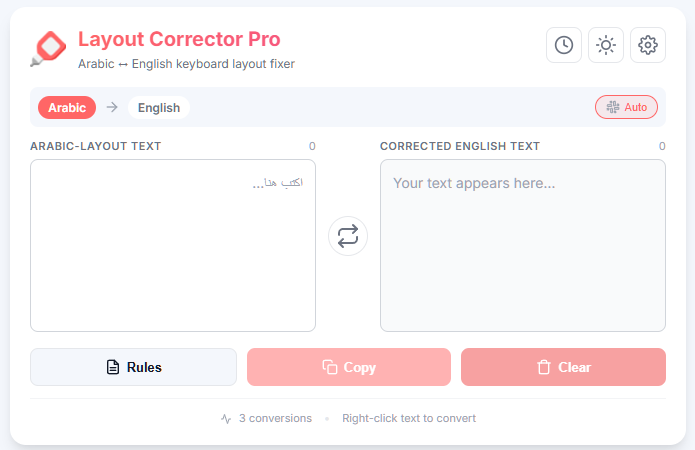

# Text Layout Corrector Pro 🚀

A powerful Chrome extension to instantly correct text typed in the wrong keyboard layout. Features custom conversion rules, on-page correction, and multiple user feedback options.



## ✨ Features

### Core Features
- **🔄 Instant Correction** - Right-click on selected text to copy the corrected version to your clipboard
- **🤖 Auto-Detection** - Automatically detects Arabic or English text and converts accordingly
- **🌙 Dark Mode** - Toggle between light and dark themes for comfortable viewing
- **📜 Conversion History** - Access your last 20 conversions for quick reference
- **🔧 Custom Rules** - Create, edit, and manage your own conversion rules

### Notification Options
- **🔔 System Notifications** - Desktop notifications when text is converted
- **🔊 Sound Effects** - Customizable audio feedback with volume control
- **✓ Badge Indicator** - Visual confirmation on the extension icon

### Advanced Features
- **🌐 Language Support** - Arabic ↔ English (more languages coming soon!)
- **📥 Import/Export Rules** - Backup and share your custom rules as JSON
- **📊 Usage Statistics** - Track your conversion count and characters processed
- **🔍 Rule Search** - Quickly find rules when you have many
- **☁️ Sync Storage** - Your settings sync across Chrome browsers

## 🛠️ Installation

### Prerequisites
- Google Chrome (or Chromium-based browser like Edge, Brave, etc.)

### Steps
1. Download this project as a ZIP file and unzip it, or clone the repository
2. Open Chrome and navigate to `chrome://extensions`
3. Enable **"Developer mode"** using the toggle in the top-right corner
4. Click the **"Load unpacked"** button
5. Select the folder where you saved the project files
6. Pin the extension to your toolbar for easy access!

## 📖 Usage

### Quick Conversion (Right-Click)
1. Select any text on a webpage that was typed with the wrong layout
2. Right-click and choose **"Correct Layout & Copy"**
3. The corrected text is now on your clipboard, ready to paste with `Ctrl+V`
4. Auto-detection works automatically - no need to specify direction!

### Manual Conversion (Popup)
1. Click the extension icon in your toolbar
2. Type or paste text in the input area
3. The corrected text appears automatically in the output area
4. Click **Copy** to save the result to your clipboard and add to history
5. Use the **swap button (⇄)** to manually change conversion direction if needed

### Managing Custom Rules
1. Click **Rules** in the popup
2. Add new rules by entering source → target mappings
3. Edit existing rules by clicking the edit icon
4. Delete rules by clicking the delete icon
5. Use **Import/Export** to backup or share your rules
6. Search for specific rules using the search box

### Viewing History
1. Click the **clock icon** in the popup header
2. Browse your last 20 conversions
3. Click "Use" to load a previous conversion
4. Clear all history with the "Clear History" button

## ⚙️ Settings

Access settings by clicking the gear icon in the popup.

### Available Settings
| Setting | Description |
|---------|-------------|
| Theme | Light, Dark, or System preference |
| Sound Effects | Enable/disable conversion sounds |
| Sound Volume | Adjust notification volume (0-100%) |
| System Notifications | Enable/disable desktop notifications |
| Auto-Detect | Automatically detect text direction (recommended) |
| Language Support | Currently Arabic ↔ English (more coming soon) |

## 🔧 Custom Rules Examples

The extension comes with default rules for common Arabic combinations:

| From | To | Description |
|------|-----|-------------|
| `ة` | `m` | Arabic Ta Marbuta → m |
| `لا` | `b` | Lam-Alef combination → b |
| `لآ` | `B` | Lam-Alef Madda → B |
| `و` | `,` | Waw → comma |

You can add your own rules for special cases!

## 📁 Project Structure

```
Text Layout Corrector/
├── manifest.json        # Extension configuration
├── background.js        # Service worker (handles conversions)
├── popup.html          # Main popup interface
├── popup.js            # Popup functionality
├── style.css           # Styles (with dark mode)
├── settings.html       # Settings page
├── settings.js         # Settings functionality
├── constants.js        # Shared constants
├── utils.js            # Utility functions
├── offscreen.html      # Offscreen document for audio
├── offscreen.js        # Audio playback handler
├── notification.mp3    # Notification sound
├── images/
│   ├── icon16.png
│   ├── icon48.png
│   └── icon128.png
├── LICENSE
└── README.md
```

## 🔒 Privacy

This extension:
- ✅ Works entirely locally - no data sent to external servers
- ✅ Only accesses the clipboard when you explicitly trigger a conversion
- ✅ Stores all data in your browser's sync storage
- ✅ No tracking, no analytics, no external connections
- ✅ Open source - you can review all the code

## 💡 Tips & Tricks

- **Auto-detect is your friend** - Leave it enabled and the extension will figure out the direction
- **Use custom rules** - Add patterns you type frequently for faster conversions
- **Check history** - Quickly reuse recent conversions instead of retyping
- **Export your rules** - Backup your custom rules before resetting or switching browsers
- **Right-click is fastest** - Select and right-click for instant correction

## 🤝 Contributing

Contributions are welcome! Feel free to:
- Report bugs
- Suggest new features
- Submit pull requests
- Share your custom rules

## 📝 Changelog

### Version 2.0.0
- 🌙 Added dark mode support
- ⌨️ Added right-click context menu
- 🤖 Added bidirectional auto-detection
- 📜 Added conversion history
- 🔧 Added rule import/export
- 📊 Added usage statistics
- 🌐 Focused on Arabic ↔ English
- ⚙️ Added comprehensive settings page
- 🎨 Complete UI redesign
- ☁️ Added Chrome sync storage

### Version 1.0.0
- Added custom rules management
- Added notification sounds
- UI improvements

### Version 0.1.0
- Initial release

## 📄 License

This project is licensed under the MIT License - see the [LICENSE](LICENSE) file for details.
